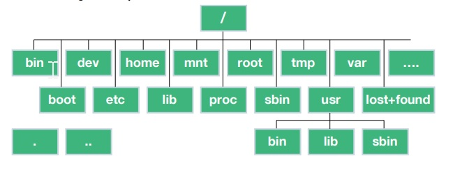

- [What is a Kernel, and What does it Do?](#what-is-a-kernel-and-what-does-it-do)
- [What is an Operating System?](#what-is-an-operating-system)
- [What is the boot process ?](#what-is-the-boot-process-)
- [What is Linux Daemon?](#what-is-linux-daemon)
- [User Space vs Kernel Space](#user-space-vs-kernel-space)
- [How is Linux Used in the Enterprise?](#how-is-linux-used-in-the-enterprise)
- [How do I know What Type of Linux I am Using?](#how-do-i-know-what-type-of-linux-i-am-using)
  - [Where do I find the things ?](#where-do-i-find-the-things-)
  - [/bin, /sbin, /usr/sbin](#bin-sbin-usrsbin)
  - [/dev](#dev)
  - [/etc](#etc)
  - [/home](#home)
  - [/var](#var)
- [Where are the applications, and how do I run them?](#where-are-the-applications-and-how-do-i-run-them)
- [How do I install Applications?](#how-do-i-install-applications)
- [Linux Processes, Programs and Services](#linux-processes-programs-and-services)
- [Importance of Linux Log Files](#importance-of-linux-log-files)
- [Users and Superusers](#users-and-superusers)
- [Files and Permissions](#files-and-permissions)


# What is a Kernel, and What does it Do?
The **kernel** is the special piece of the operating system that controls 
- the CPU hardware
- allocates memory 
- accesses data
- schedules processes 
- runs the applications
- protects them from each other

It is the first program loaded on the computer when the computer starts up. The most critical pieces of code in the kernel are loaded into protected areas of memory so that they cant be overwritten by other applications running in the operating system.

# What is an Operating System?

Hardware -> Kernel -> Operating System => Libraries, System Daemons, Shells, Tools


# What is the boot process ?
Note: Explain the booting process here

# What is Linux Daemon?
A **system daemon** in Linux is typically a background system process that awaits a specific set of conditions before jumping into action.

For example, your Linux system may have a daemon called *sshd*. This system daemon runs in the background and accepts authorized incoming requests to log into the Linux host.

System daemons do not interact with users and are not typically under the direct control of users, but rather of the system itself. 

# User Space vs Kernel Space 

Operating systems all execute their kernel in protected and restricted memory that is called **kernel space** to prevent the kernel from terminating and crashing the system. 

When a user runs an application or tool, that application or tool executes in what is called **user space**. By running these application seperate from kernel space, they cant tamper with the kernel resources and cause the system to panic(crash).

All applications, even system daemon processes that perform critical operating system functions, must make what is called a **system call** to the kernel space in order to access system resources such as *memory* or *network devices*.

Separating between user space and kernel space  is made to ensure that Linux is as reliable and secure an operating system as possible.

**Note:**  Figure 1.4

# How is Linux Used in the Enterprise?
- Automation and orchestration
- Server Virtualisation

The software that allows VMs to function is called a *hypervisor*. Linux includes an excellent hypervisor called **KVM**.

- Private Cloud
- Big Data
- Containers

# How do I know What Type of Linux I am Using?

The **uname** command shows the basic type of operating system you are using.

```bash
utku@# uname -a
Linux mydomain.net 5.15.0-113-generic #123-Ubuntu SMP Mon Jun 10 08:16:17 UTC 2024 x86_64 x86_64 x86_64 GNU/Linux
```
**hostnamectl** command shows you the hostname of the linux server as well as the other system informations.

```bash
# hostnamectl 
 Static hostname: debian
       Icon name: computer-vm
         Chassis: vm
      Machine ID: 5120104a8a29sdfsdf190623b65910546
         Boot ID: f311csdfsdfsdfe4a06b274f2148c994dee
  Virtualization: kvm
Operating System: Ubuntu 22.04.4 LTS               
          Kernel: Linux 5.15.0-113-generic
    Architecture: x86-64
 Hardware Vendor: QEMU
  Hardware Model: Standard PC _i440FX + PIIX, 1996_
```

## Where do I find the things ? 

Files and folders. Interaction with and navigation of the linux file system is done up and down the tree with commands such as:

- pwd
- ls
- cd
- rm
- mkdir , rmdir



## /bin, /sbin, /usr/sbin
Executable programs are stored.

## /dev 
Where files representing hardware devices are stored. Like floppy drive device /dev/fd0

## /etc
Where configuration files are stored.

## /home
Where user home directories are stored, one for each user

## /var

Where variable-length files, like log files, are stored.

# Where are the applications, and how do I run them?

Most user tools are found in the directories */bin*, */usr/bin* and system tools are typically
located in */sbin* and */usr/sbin*. 

For example, tools like **cp**, **ps**, **cat**.All are found in */bin*.

The useful thing is that you dont need to go into any of these directories and run the particular tool because these directories are included in your **$PATH** variable by default.

```bash
root@vmi1580390:~/blog# echo $PATH
/usr/local/sbin:/usr/local/bin:/usr/sbin:/usr/bin:/sbin:/bin:/usr/games:/usr/local/games:/snap/bin:
```

To run an application that you created if the directory of the application is not in the **$PATH** variable. First, we need to go to the directory then run the application **./myapp**.

**apt list --installed** and get a list of the packages that are already installed. **apt list | less** gives the output page by page.


# How do I install Applications?

This command doesnt actually update any software, but it does make sure you are looking at a list of currently available package versions.

**sudo apt update**

To install a packet, **sudo apt install ssh**.

To verify a package that we installed correctly. **apt show ssh**.

# Linux Processes, Programs and Services

In Linux, when you start a program, it will run interectively by default. However, you can also run programs in the background (often called services.)

This feature can be handy if you have a program that will take some time to process.You can just put it in the background and be alerted when it is completed.

**/sbin/init** is PID (Process Identifier) #1 and its owned by root.
```bash
root@vmi1580390:~/blog# ps -ef
UID          PID    PPID  C STIME TTY          TIME CMD
root           1       0  0  2024 ?        00:07:09 /sbin/init
root           2       0  0  2024 ?        00:00:01 [kthreadd]
root           3       2  0  2024 ?        00:00:00 [rcu_gp]
root           4       2  0  2024 ?        00:00:00 [rcu_par_gp]
```
Another option of the command is **ps -ef | less**.

If you run only **ps**. You will see only the your running process.

```bash
root@vmi1580390:~/blog# ps
    PID TTY          TIME CMD
1525778 pts/9    00:00:00 bash
1531185 pts/9    00:00:00 ps
```

Linux uses the concept of *system services*, which are long running programs that are run in the background and typically provide some service on behalf of system users. You can start, stop and check the status of services with the command **systemctl**.

There is another useful command to check the logs is **journalctl**.

# Importance of Linux Log Files

Most linux systems log files will be found in **/var/log**.

Some important log files are 
- syslog
- auth.log
- messages


A variety of different tools can be used to view and parse log files, such as:

- cat
- less
- grep
- head
- tail
  - tail -f /var/log/syslog

# Users and Superusers

In Linux, administrative privileges are preferred to as *superuser* privileges and are equivalent to the root user, who has a user ID of 0.

- adduser
- moduser
- deluser

```bash
root@vm:~/blog# id
uid=0(root) gid=0(root) groups=0(root)
root@vm:~/blog# whoami
root
root@vm:~/blog# sudo id
uid=0(root) gid=0(root) groups=0(root)
root@vm:~/blog# sudo whoami
root
root@vm:~/blog#
```

Many systems prevent you from becoming the root user with **su** and instead require you to use the **sudo** command.

The priveleges for who can run what are determined by the */etc/sudoers* file, and that file should be edited using **visudo** command to ensure safe access to a critically important configuration file. 


# Files and Permissions
