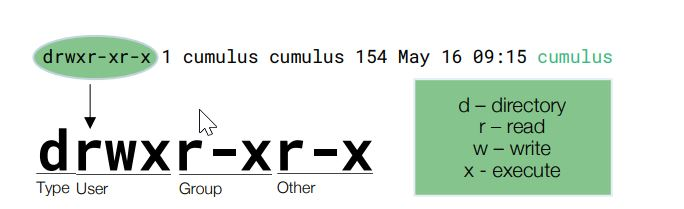

- [1. What is a Kernel, and What does it Do?](#1-what-is-a-kernel-and-what-does-it-do)
- [2. What is an Operating System?](#2-what-is-an-operating-system)
- [3. What is the boot process ?](#3-what-is-the-boot-process-)
- [4. What is Linux Daemon?](#4-what-is-linux-daemon)
- [5. User Space vs Kernel Space](#5-user-space-vs-kernel-space)
- [6. How is Linux Used in the Enterprise?](#6-how-is-linux-used-in-the-enterprise)
- [7. How do I know What Type of Linux I am Using?](#7-how-do-i-know-what-type-of-linux-i-am-using)
  - [7.1. Where do I find the things ?](#71-where-do-i-find-the-things-)
  - [7.2. /bin, /sbin, /usr/sbin](#72-bin-sbin-usrsbin)
  - [7.3. /dev](#73-dev)
  - [7.4. /etc](#74-etc)
  - [7.5. /home](#75-home)
  - [7.6. /var](#76-var)
- [8. Where are the applications, and how do I run them?](#8-where-are-the-applications-and-how-do-i-run-them)
- [9. How do I install Applications?](#9-how-do-i-install-applications)
- [10. Linux Processes, Programs and Services](#10-linux-processes-programs-and-services)
- [11. Importance of Linux Log Files](#11-importance-of-linux-log-files)
- [12. Users and Superusers](#12-users-and-superusers)
- [13. Files and Permissions](#13-files-and-permissions)
- [14. Understanding Linux Network Interfaces](#14-understanding-linux-network-interfaces)
  - [14.1. Predictable Network Interface naming convention](#141-predictable-network-interface-naming-convention)
  - [14.2. ip link command](#142-ip-link-command)
  - [14.3. DHCP](#143-dhcp)
  - [14.4. DNS](#144-dns)
    - [14.4.1. /etc/hosts file](#1441-etchosts-file)
    - [14.4.2. /etc/resolv.conf file](#1442-etcresolvconf-file)
    - [14.4.3. dig / getent ahosts / nslookup](#1443-dig--getent-ahosts--nslookup)
  - [14.5. Network Statistics and Counters](#145-network-statistics-and-counters)
  - [14.6. Configuring Network Interfaces](#146-configuring-network-interfaces)


# 1. What is a Kernel, and What does it Do?
The **kernel** is the special piece of the operating system that controls 
- the CPU hardware
- allocates memory 
- accesses data
- schedules processes 
- runs the applications
- protects them from each other

It is the first program loaded on the computer when the computer starts up. The most critical pieces of code in the kernel are loaded into protected areas of memory so that they cant be overwritten by other applications running in the operating system.

# 2. What is an Operating System?

Hardware -> Kernel -> Operating System => Libraries, System Daemons, Shells, Tools


# 3. What is the boot process ?
Note: Explain the booting process here

# 4. What is Linux Daemon?
A **system daemon** in Linux is typically a background system process that awaits a specific set of conditions before jumping into action.

For example, your Linux system may have a daemon called *sshd*. This system daemon runs in the background and accepts authorized incoming requests to log into the Linux host.

System daemons do not interact with users and are not typically under the direct control of users, but rather of the system itself. 

# 5. User Space vs Kernel Space 

Operating systems all execute their kernel in protected and restricted memory that is called **kernel space** to prevent the kernel from terminating and crashing the system. 

When a user runs an application or tool, that application or tool executes in what is called **user space**. By running these application seperate from kernel space, they cant tamper with the kernel resources and cause the system to panic(crash).

All applications, even system daemon processes that perform critical operating system functions, must make what is called a **system call** to the kernel space in order to access system resources such as *memory* or *network devices*.

Separating between user space and kernel space  is made to ensure that Linux is as reliable and secure an operating system as possible.

**Note:**  Figure 1.4

# 6. How is Linux Used in the Enterprise?
- Automation and orchestration
- Server Virtualisation

The software that allows VMs to function is called a *hypervisor*. Linux includes an excellent hypervisor called **KVM**.

- Private Cloud
- Big Data
- Containers

# 7. How do I know What Type of Linux I am Using?

The **uname** command shows the basic type of operating system you are using.

```bash
utku@# uname -a
Linux mydomain.net 5.15.0-113-generic #123-Ubuntu SMP Mon Jun 10 08:16:17 UTC 2024 x86_64 x86_64 x86_64 GNU/Linux
```
**hostnamectl** command shows you the hostname of the linux server as well as the other system informations.

```bash
# hostnamectl 
 Static hostname: debian
       Icon name: computer-vm
         Chassis: vm
      Machine ID: 5120104a8a29sdfsdf190623b65910546
         Boot ID: f311csdfsdfsdfe4a06b274f2148c994dee
  Virtualization: kvm
Operating System: Ubuntu 22.04.4 LTS               
          Kernel: Linux 5.15.0-113-generic
    Architecture: x86-64
 Hardware Vendor: QEMU
  Hardware Model: Standard PC _i440FX + PIIX, 1996_
```

## 7.1. Where do I find the things ? 

Files and folders. Interaction with and navigation of the linux file system is done up and down the tree with commands such as:

- pwd
- ls
- cd
- rm
- mkdir , rmdir


## 7.2. /bin, /sbin, /usr/sbin
Executable programs are stored.

## 7.3. /dev 
Where files representing hardware devices are stored. Like floppy drive device /dev/fd0

## 7.4. /etc
Where configuration files are stored.

## 7.5. /home
Where user home directories are stored, one for each user

## 7.6. /var

Where variable-length files, like log files, are stored.

# 8. Where are the applications, and how do I run them?

Most user tools are found in the directories */bin*, */usr/bin* and system tools are typically
located in */sbin* and */usr/sbin*. 

For example, tools like **cp**, **ps**, **cat**.All are found in */bin*.

The useful thing is that you dont need to go into any of these directories and run the particular tool because these directories are included in your **$PATH** variable by default.

```bash
root@vmi1580390:~/blog# echo $PATH
/usr/local/sbin:/usr/local/bin:/usr/sbin:/usr/bin:/sbin:/bin:/usr/games:/usr/local/games:/snap/bin:
```

To run an application that you created if the directory of the application is not in the **$PATH** variable. First, we need to go to the directory then run the application **./myapp**.

**apt list --installed** and get a list of the packages that are already installed. **apt list | less** gives the output page by page.


# 9. How do I install Applications?

This command doesnt actually update any software, but it does make sure you are looking at a list of currently available package versions.

**sudo apt update**

To install a packet, **sudo apt install ssh**.

To verify a package that we installed correctly. **apt show ssh**.

# 10. Linux Processes, Programs and Services

In Linux, when you start a program, it will run interectively by default. However, you can also run programs in the background (often called services.)

This feature can be handy if you have a program that will take some time to process.You can just put it in the background and be alerted when it is completed.

**/sbin/init** is PID (Process Identifier) #1 and its owned by root.
```bash
root@vmi1580390:~/blog# ps -ef
UID          PID    PPID  C STIME TTY          TIME CMD
root           1       0  0  2024 ?        00:07:09 /sbin/init
root           2       0  0  2024 ?        00:00:01 [kthreadd]
root           3       2  0  2024 ?        00:00:00 [rcu_gp]
root           4       2  0  2024 ?        00:00:00 [rcu_par_gp]
```
Another option of the command is **ps -ef | less**.

If you run only **ps**. You will see only the your running process.

```bash
root@vmi1580390:~/blog# ps
    PID TTY          TIME CMD
1525778 pts/9    00:00:00 bash
1531185 pts/9    00:00:00 ps
```

Linux uses the concept of *system services*, which are long running programs that are run in the background and typically provide some service on behalf of system users. You can start, stop and check the status of services with the command **systemctl**.

There is another useful command to check the logs is **journalctl**.

# 11. Importance of Linux Log Files

Most linux systems log files will be found in **/var/log**.

Some important log files are 
- syslog
- auth.log
- messages


A variety of different tools can be used to view and parse log files, such as:

- cat
- less
- grep
- head
- tail
  - tail -f /var/log/syslog

# 12. Users and Superusers

In Linux, administrative privileges are preferred to as *superuser* privileges and are equivalent to the root user, who has a user ID of 0.

- adduser
- moduser
- deluser

```bash
root@vm:~/blog# id
uid=0(root) gid=0(root) groups=0(root)
root@vm:~/blog# whoami
root
root@vm:~/blog# sudo id
uid=0(root) gid=0(root) groups=0(root)
root@vm:~/blog# sudo whoami
root
root@vm:~/blog#
```

Many systems prevent you from becoming the root user with **su** and instead require you to use the **sudo** command.

The priveleges for who can run what are determined by the */etc/sudoers* file, and that file should be edited using **visudo** command to ensure safe access to a critically important configuration file. 


# 13. Files and Permissions

```bash
root@# ls -al /var/log/syslog
-rw-r----- 1 syslog adm 32402 Jan  6 00:20 /var/log/syslog
```
- The file is owned by syslog and the group "adm".
- The file permissions are rw and r for the group and with no permission for anyone else.
- The two most important types of objects in the linux system are directories(d) and files(-).
- **UGO** is the abbrevation to remember the file permission to the users.User, group and others.



# 14. Understanding Linux Network Interfaces

## 14.1. Predictable Network Interface naming convention
- Loopback (lo)
- Ethernet 0 (eth0)

With the *predictable network interface* naming convention. So, rather than an interface named **eth0**, it may have one named **ens3** or **enp0s3**.

The format follows a pattern such as;
```
<type><slot><number>
```

- **type** can be en for Ethernet, wl for Wi-Fi, br for bridges, veth for virtual interfaces, etc.
- **slot** refers to the physical location of the device, often a combination of letters and numbers that specify the device's bus, slot, or other identifying factors.
- **number** is a unique identifier for each device of the same type.

For example:
- enp3s0: Ethernet interface located at PCI bus 3, slot 0
- wlp2s0: Wireless interface located at PCI bus 2, slot 0
- enx001e06302d29: Ethernet interface identified by its MAC address (00:1e:06:30:2d:29)
- VLANs: enp3s0.10 (VLAN 10 on interface enp3s0)

Why Predictable Naming?
Predictable naming improves network configuration and management in various ways:

- *Avoids interface renaming after reboots*: Older systems would often rename interfaces on reboot based on the order in which they were detected.
- *Better identification of hardware*: The new names help you easily identify the location of physical hardware and virtual interfaces based on their names.
- *Consistency*: It reduces confusion and errors when working with multiple network interfaces, especially in environments with many devices or virtual interfaces (e.g., containers, virtual machines)

## 14.2. ip link command

**ip link** command shows all the interfaces in a linux system. Output also contains MAC,MTU etc.

```bash
pi@raspberrypi02:~$ ip link
1: lo: <LOOPBACK,UP,LOWER_UP> mtu 65536 qdisc noqueue state UNKNOWN mode DEFAULT group default qlen 1000
    link/loopback 00:00:00:00:00:00 brd 00:00:00:00:00:00
2: eth0: <BROADCAST,MULTICAST,UP,LOWER_UP> mtu 1500 qdisc pfifo_fast state UP mode DEFAULT group default qlen 1000
    link/ether b8:27:eb:db:e2:91 brd ff:ff:ff:ff:ff:ff
3: wlan0: <BROADCAST,MULTICAST,UP,LOWER_UP> mtu 1500 qdisc pfifo_fast state UP mode DORMANT group default qlen 1000
    link/ether b8:27:eb:8e:b7:c4 brd ff:ff:ff:ff:ff:ff
```

The **ip link** command is also used to configure network interfaces. For example, you can change the status of the interfaces.
```bash
ip link set [dev] {up | down}
ip link set lo mtu 1500
man ip link # for more info
```

From the above output, we get MAC addresses. What if we want to get the IPs. 
```bash
pi@raspberrypi02:~$ ip addr
1: lo: <LOOPBACK,UP,LOWER_UP> mtu 65536 qdisc noqueue state UNKNOWN group default qlen 1000
    link/loopback 00:00:00:00:00:00 brd 00:00:00:00:00:00
    inet 127.0.0.1/8 scope host lo
       valid_lft forever preferred_lft forever
    inet6 ::1/128 scope host 
       valid_lft forever preferred_lft forever
2: eth0: <BROADCAST,MULTICAST,UP,LOWER_UP> mtu 1500 qdisc pfifo_fast state UP group default qlen 1000
    link/ether b8:27:eb:db:e2:91 brd ff:ff:ff:ff:ff:ff
    inet 192.168.178.172/24 brd 192.168.178.255 scope global noprefixroute eth0
       valid_lft forever preferred_lft forever
    inet6 2001:1c08:700:dd00:55cd:49c2:b8d0:7075/64 scope global dynamic mngtmpaddr noprefixroute 
       valid_lft 604695sec preferred_lft 604695sec
    inet6 fe80::205d:217c:7509:8959/64 scope link 
       valid_lft forever preferred_lft forever
3: wlan0: <BROADCAST,MULTICAST,UP,LOWER_UP> mtu 1500 qdisc pfifo_fast state UP group default qlen 1000
    link/ether b8:27:eb:8e:b7:c4 brd ff:ff:ff:ff:ff:ff
    inet 192.168.178.219/24 brd 192.168.178.255 scope global dynamic noprefixroute wlan0
       valid_lft 53743sec preferred_lft 42943sec
    inet6 2001:1c08:700:dd00:202:7551:e582:b99f/64 scope global dynamic mngtmpaddr noprefixroute 
       valid_lft 604695sec preferred_lft 604695sec
    inet6 fe80::9918:ba05:52b4:46dd/64 scope link 
       valid_lft forever preferred_lft forever

```

Other useful network tools are given below.

```bash
nc -zv [remote-host] [port-number]
pi@raspberrypi02:~$ nc -zv www.google.com 80
Connection to www.google.com (2a00:1450:400e:802::2004) 80 port [tcp/http] succeeded!
pi@raspberrypi02:~$ nc -zv www.google.com 8080
^C
pi@raspberrypi02:~$ nc -zv www.google.com 443
Connection to www.google.com (2a00:1450:400e:805::2004) 443 port [tcp/https] succeeded!

pi@raspberrypi02:~$ ping -c1 www.google.com

```

## 14.3. DHCP

The local configuration file for the DHCP client(called dhclient) is at /etc/dhcp/dhclient.conf. This configuration dictates to Linux how it will receive IP configuration information from a DHCP server.

**dynamic** means that Linux get IP information from a dhcp server.

```bash
2: eth0: <BROADCAST,MULTICAST,UP,LOWER_UP> mtu 1500 qdisc pfifo_fast state UP group default qlen 1000
    link/ether b8:27:eb:db:e2:91 brd ff:ff:ff:ff:ff:ff
    inet 192.168.178.172/24 brd 192.168.178.255 scope global noprefixroute eth0
       valid_lft forever preferred_lft forever
    inet6 2001:1c08:700:dd00:55cd:49c2:b8d0:7075/64 scope global **dynamic** mngtmpaddr noprefixroute 
       valid_lft 604692sec preferred_lft 604692sec
    inet6 fe80::205d:217c:7509:8959/64 scope link 
       valid_lft forever preferred_lft forever

```

To check the status on the DHCP client, you can **cat** the syslog and **grep** for dhcp.
```bash
sudo grep -Ei dhcp /var/log/syslog
Jan  8 23:58:28 raspberrypi02 dhcpcd[503]: wlan0: carrier lost
Jan  8 23:58:28 raspberrypi02 dhcpcd[503]: wlan0: deleting address 2001:1c08:700:dd00:202:7551:e582:b99f/64
Jan  8 23:58:28 raspberrypi02 dhcpcd[503]: wlan0: deleting route to 2001:1c08:700:dd00::/64
Jan  8 23:58:28 raspberrypi02 dhcpcd[503]: wlan0: deleting default route via fe80::9698:8fff:fe91:1af0
Jan  8 23:58:29 raspberrypi02 dhcpcd[503]: wlan0: deleting address fe80::9918:ba05:52b4:46dd
Jan  8 23:58:29 raspberrypi02 dhcpcd[503]: wlan0: deleting route to 192.168.178.0/24
Jan  8 23:58:29 raspberrypi02 dhcpcd[503]: wlan0: deleting default route via 192.168.178.1
Jan  8 23:58:29 raspberrypi02 dhcpcd[503]: eth0: fe80::9698:8fff:fe91:1af0 is unreachable
Jan  8 23:58:29 raspberrypi02 dhcpcd[503]: eth0: soliciting an IPv6 router
Jan  8 23:58:29 raspberrypi02 dhcpcd[503]: eth0: Router Advertisement from fe80::9698:8fff:fe91:1af0
Jan  8 23:58:40 raspberrypi02 dhcpcd[503]: wlan0: carrier acquired
Jan  8 23:58:40 raspberrypi02 dhcpcd[503]: wlan0: IAID eb:8e:b7:c4
Jan  8 23:58:40 raspberrypi02 dhcpcd[503]: wlan0: adding address fe80::9918:ba05:52b4:46dd
Jan  8 23:58:41 raspberrypi02 dhcpcd[503]: wlan0: rebinding lease of 192.168.178.219
Jan  8 23:58:41 raspberrypi02 dhcpcd[503]: wlan0: soliciting an IPv6 router
Jan  8 23:58:45 raspberrypi02 dhcpcd[503]: wlan0: Router Advertisement from fe80::9698:8fff:fe91:1af0
Jan  8 23:58:45 raspberrypi02 dhcpcd[503]: wlan0: adding address 2001:1c08:700:dd00:202:7551:e582:b99f/64
Jan  8 23:58:45 raspberrypi02 dhcpcd[503]: wlan0: adding route to 2001:1c08:700:dd00::/64
Jan  8 23:58:45 raspberrypi02 dhcpcd[503]: wlan0: requesting DHCPv6 information
Jan  8 23:58:45 raspberrypi02 dhcpcd[503]: wlan0: adding default route via fe80::9698:8fff:fe91:1af0
Jan  8 23:58:45 raspberrypi02 dhcpcd[503]: wlan0: probing address 192.168.178.219/24
Jan  8 23:58:50 raspberrypi02 dhcpcd[503]: wlan0: leased 192.168.178.219 for 86400 seconds
Jan  8 23:58:50 raspberrypi02 dhcpcd[503]: wlan0: adding route to 192.168.178.0/24
Jan  8 23:58:50 raspberrypi02 dhcpcd[503]: wlan0: adding default route via 192.168.178.1
```

## 14.4. DNS

To find out if your Linux host is using DNS, we will be running some troubleshooting commands, such as **dig** and **nslookup**.

### 14.4.1. /etc/hosts file

This file is the first point of lookup for any host name prior out to a DNS server on the network. If the name is found there, no further searches are performed.

### 14.4.2. /etc/resolv.conf file

This file shows the local domains to be searched and what server names to use for DNS resolutions.

```bash
pi@raspberrypi02:~$ sudo cat /etc/resolv.conf
# Generated by resolvconf
domain arnhem.chello.nl
nameserver 2001:b88:1002::10
nameserver 2001:b88:1202::10
nameserver 2001:730:3e42:1000::53
nameserver 213.46.228.196
nameserver 62.179.104.196
pi@raspberrypi02:~$ sudo cat /etc/host
cat: /etc/host: No such file or directory
pi@raspberrypi02:~$ sudo cat /etc/hosts
127.0.0.1       localhost
::1             localhost ip6-localhost ip6-loopback
ff02::1         ip6-allnodes
ff02::2         ip6-allrouters

127.0.1.1       raspberrypi02
```
### 14.4.3. dig / getent ahosts / nslookup

```bash
pi@raspberrypi02:~$ dig www.google.com

; <<>> DiG 9.16.44-Debian <<>> www.google.com
;; global options: +cmd
;; Got answer:
;; ->>HEADER<<- opcode: QUERY, status: NOERROR, id: 59178
;; flags: qr rd ra; QUERY: 1, ANSWER: 1, AUTHORITY: 0, ADDITIONAL: 1

;; OPT PSEUDOSECTION:
; EDNS: version: 0, flags:; udp: 512
;; QUESTION SECTION:
;www.google.com.                        IN      A

;; ANSWER SECTION:
www.google.com.         51      IN      A       142.251.39.100

;; Query time: 15 msec
;; SERVER: 2001:b88:1002::10#53(2001:b88:1002::10)
;; WHEN: Sat Jan 11 15:40:03 CET 2025
;; MSG SIZE  rcvd: 59

pi@raspberrypi02:~$ get
getcap       getcifsacl   getconf      get-edid     getent       getfacl      getkeycodes  getopt       getopts      getpcaps     gettext      gettext.sh   getty        
pi@raspberrypi02:~$ getent ahosts
127.0.0.1       localhost
127.0.0.1       localhost ip6-localhost ip6-loopback
127.0.1.1       raspberrypi02
pi@raspberrypi02:~$ sudo cat /etc/hosts
127.0.0.1       localhost
::1             localhost ip6-localhost ip6-loopback
ff02::1         ip6-allnodes
ff02::2         ip6-allrouters

127.0.1.1       raspberrypi02
pi@raspberrypi02:~$ nslookup www.google.com
Server:         2001:b88:1002::10
Address:        2001:b88:1002::10#53

Non-authoritative answer:
Name:   www.google.com
Address: 142.250.179.164
Name:   www.google.com
Address: 2a00:1450:400e:802::2004

pi@raspberrypi02:~$ nslookup www.google.com 1.1.1.1
Server:         1.1.1.1
Address:        1.1.1.1#53

Non-authoritative answer:
Name:   www.google.com
Address: 142.251.39.100
Name:   www.google.com
Address: 2a00:1450:400e:811::2004

```
## 14.5. Network Statistics and Counters 

When performing network troubshooting, it is always good to gather some statistics and we need to ask some questions and try to find answers like;

-  Is the network interface even transmitting any data?
-  Is the interface taking errors?
-  What process sending all that traffic?


- **ip -s link** is showing us the statistics for network links.

```bash
pi@raspberrypi02:~$ ip -s link
1: lo: <LOOPBACK,UP,LOWER_UP> mtu 65536 qdisc noqueue state UNKNOWN mode DEFAULT group default qlen 1000
    link/loopback 00:00:00:00:00:00 brd 00:00:00:00:00:00
    RX: bytes  packets  errors  dropped missed  mcast   
    325249     4990     0       0       0       0       
    TX: bytes  packets  errors  dropped carrier collsns 
    325249     4990     0       0       0       0       
2: eth0: <BROADCAST,MULTICAST,UP,LOWER_UP> mtu 1500 qdisc pfifo_fast state UP mode DEFAULT group default qlen 1000
    link/ether b8:27:eb:db:e2:91 brd ff:ff:ff:ff:ff:ff
    RX: bytes  packets  errors  dropped missed  mcast   
    36100684   253018   0       0       0       0       
    TX: bytes  packets  errors  dropped carrier collsns 
    9093439    57783    0       0       0       0       
3: wlan0: <BROADCAST,MULTICAST,UP,LOWER_UP> mtu 1500 qdisc pfifo_fast state UP mode DORMANT group default qlen 1000
    link/ether b8:27:eb:8e:b7:c4 brd ff:ff:ff:ff:ff:ff
    RX: bytes  packets  errors  dropped missed  mcast   
    16435652   118444   0       0       0       86873   
    TX: bytes  packets  errors  dropped carrier collsns 
    2564565    24813    0       0       0       0  
```


- **netstat** is showing us what our active processes are that have the network interface open.

```bash
pi@raspberrypi02:~$ netstat 
Active Internet connections (w/o servers)
Proto Recv-Q Send-Q Local Address           Foreign Address         State      
tcp        0    208 192.168.178.172:ssh     192.168.178.47:56213    ESTABLISHED

The other states are TIME_WAIT, CLOSE_WAIT.
```

- **netstat -l** shows the active listening services on the host

```bash
pi@raspberrypi02:~$ netstat -l
Active Internet connections (only servers)
Proto Recv-Q Send-Q Local Address           Foreign Address         State      
tcp        0      0 localhost:ipp           0.0.0.0:*               LISTEN     
tcp        0      0 localhost:4711          0.0.0.0:*               LISTEN     
tcp        0      0 0.0.0.0:http            0.0.0.0:*               LISTEN     
tcp        0      0 0.0.0.0:ssh             0.0.0.0:*               LISTEN     
tcp        0      0 0.0.0.0:domain          0.0.0.0:*               LISTEN     
tcp6       0      0 localhost:4711          [::]:*                  LISTEN     
tcp6       0      0 [::]:http               [::]:*                  LISTEN     
tcp6       0      0 localhost:ipp           [::]:*                  LISTEN     
tcp6       0      0 [::]:ssh                [::]:*                  LISTEN     
tcp6       0      0 [::]:domain             [::]:*                  LISTEN   
```

## 14.6. Configuring Network Interfaces

There is two types of making any changes in Linux;

-  Changes that are immediately effective but are **non-persistent**. They wont survice after a restart of the operating system.
-  Changes that are effective after the next restart of the OS, known as **persistent changes**.

Lets give an example;

We want to change the eth0 IP address. To make this happen, we need to run the following command;

`ip address add 10.10.10.10/8 dev eth0`

However, once the Linux machine is restarted, the default IP address will be back on interface eth0.To make this IP address change persistent, we need to edit the file `/etc/network/interfaces` and add the configuration for eth0. In CentOS or RHEL, the file is `/etc/sysconfig/network-scripts`.


